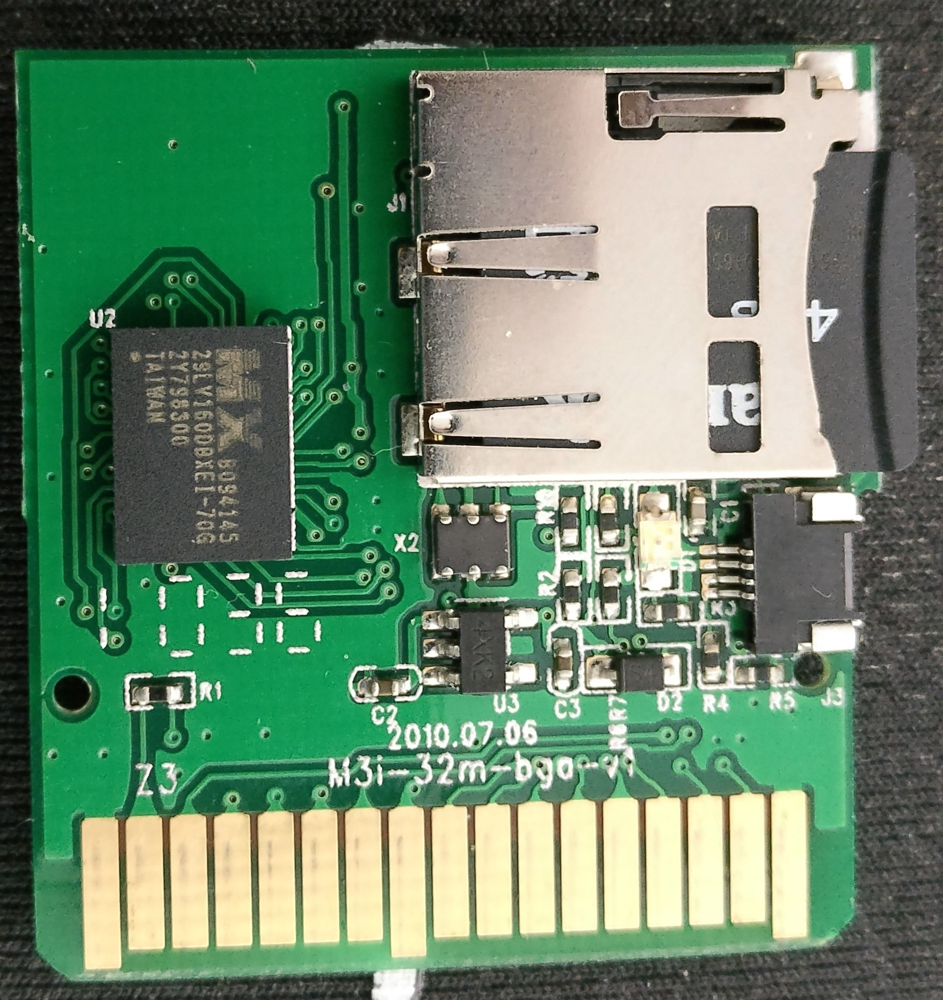

## Synopsis

Set of information and tools whilst working with my M3i Zero (`GMP-Z003`) and
it's firmware.

## Hardware

### Flash Memory

The `GMP-Z003` uses a `MX29LV160DBXEI-70G` for flash memory, it is a 2MB chip.
This device operates over a voltage range of 2.7V to 3.6V typically using a 3V
power supply input. The flash memory is read directly to the NDS as a cartridge,
the format of which can be found [here](http://dsibrew.org/wiki/DSi_Cartridge_Header).
It is writeable through the flashing process.

### Flashing

The device can be flashed by providing DC power to the `J3` port. I just stripped
a USB cable and put the positive and ground in. The micro-controller searches
the SD card for `/F_CORE.DAT` and copies `0x200000 -> 0x400000` to the flash
memory chip. I believe the `F_CORE.DAT` needs to be signed in order for the
micro-controller to copy it first however.

The LED light `D1` will change depending on the status of the flash:
* Nothing: No power or completed
* Static: Error reading `F_CORE.DAT` (SD card might not be inserted, etc..)
* Flashing: Copying `F_CORE.DAT` to the flash memory.

Alternatively the device can be flashed whilst inserted via the DS itself,
need to document this but it involves talking to the card as if it had an EEPROM
chip like normal DS cartridges.

The card responds to commands `0xa7586000` with the following payloads:

* `0xB0`: returns the type of card (The `GMP-Z003` should return `0x5AA5`)
* `0xB4`: sends a map?
* `0xB9`: reads from the logic card?
* `0xBB`: writes to the logic card (flash memory or the pic idk yet)
