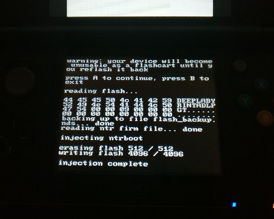

# M3i GMP-Z003 NTRBoot Injector

## Synopsis

A tool to flash bootrom hacks onto your M3i GMP-Z003 (no the older model will not work with this)
You can use this if you can't use [ntrboot_flasher](https://github.com/kitling/ntrboot_flasher)

If you don't know what you're doing, stop.

## Usage

**Make sure your M3i Zero is flashed to either 4.1 or 4.2. Version 4.5 will not work.**
The game cart should read `Deep Labyrinth` or `Rafa Nadal Tennis`.

If you already have a hacked 3DS you can do either of these:

* Use [ntrboot_flasher](https://github.com/kitling/ntrboot_flasher)
* Use `z003_ntrboot_dsi.nds` from the [hb-menu](https://github.com/devkitPro/nds-hb-menu) application.

If you have a DS device that will boot the flashcart (doesn't have to be hacked) then you can:

* Use `z003_ntrboot_ds.nds` from M3 Sakura.

When using `z003_ntrboot_ds(i).nds` ensure you have the **NTR** FIRM payload you want in the file:
`inject_ntr.firm` next to the NDS file on the SD card (and also the root just to be sure.)

Backups are stored in: `flash_backup.nds`

## Downloads

You can download precompiled binaries of `z003_ntrboot_ds(i).nds` from the releases section.

## Credits

TuxSH, WinterMute and NormMatt for putting up with me asking dumb shit in #Cakey